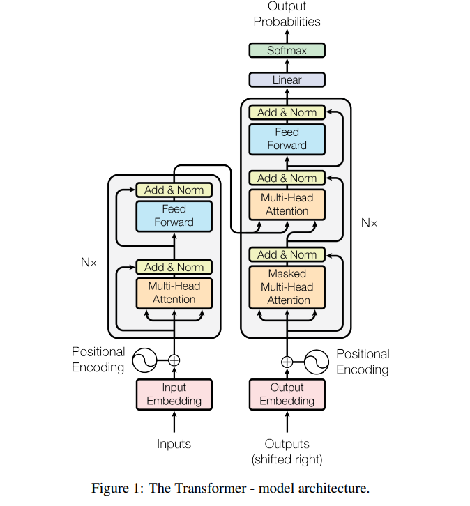

# Exploring the Fundamentals of Transformers

This repository is a deep dive into the core concepts of the Transformer architecture. Inspired by the seminal paper [“Attention is All You Need”](https://arxiv.org/abs/1706.03762v7), I set out to implement each key component separately, allowing for a clear understanding of how Transformers work from the ground up.

---

## Project Motivation

Transformers have revolutionized the field of natural language processing by replacing traditional recurrent models with an attention mechanism that enables parallel processing and effective handling of long-range dependencies. The primary goal of this project is not just to build a working model, but to **demystify** the inner workings of Transformers. By creating each component individually, following the structure presented in the paper, you can gain insight into:
- **How self-attention works**: Allowing every token in a sequence to attend to every other token.
- **The role of multi-head attention**: Enabling the model to capture information from different representation subspaces simultaneously.
- **Positional encoding**: Incorporating sequence order information into a non-recurrent architecture.
- **Layer normalization and residual connections**: Ensuring stable and efficient training of deep networks.

---

## Architecture Components

- **Encoder and Decoder Stacks**  
  The implementation follows the classic encoder-decoder structure:
  - **Encoder**: A stack of identical layers, each with self-attention and a feed-forward network, connected by residual links and layer normalization.
  - **Decoder**: Similar to the encoder, but with an extra cross-attention layer that integrates information from the encoder output, while also using masking to preserve auto-regressive properties.

- **Attention Mechanisms**  
  The attention component is the heart of the Transformer:
  - **Scaled Dot-Product Attention**: Computes attention scores by scaling the dot products of query and key vectors.
  - **Multi-Head Attention**: Projects inputs into multiple subspaces and processes them in parallel, enhancing the model's ability to capture diverse patterns.

- **Feed-Forward Networks and Positional Embeddings**  
  - Each layer includes a position-wise feed-forward network that applies non-linear transformations.
  - Positional embeddings (using sinusoidal functions) inject information about the position of tokens, enabling the model to understand sequence order despite the lack of recurrence.

---

## Example Application: English-to-Spanish Translator

While the main focus of the project is to understand and implement the Transformer architecture, I also built an English-to-Spanish translator as a practical example of how these components can be integrated into a real-world application. This translator demonstrates:
- How to preprocess text data and construct vocabularies.
- How to train a Transformer on a dataset (20MB, ~270,787 sentence pairs).
- How to generate translations using the trained model.

The translator serves as a concrete case study that ties together all the individual pieces, showing that a solid grasp of Transformer fundamentals can be leveraged to build complex NLP applications.

---

## Links of Interest

- **Original Paper**: [Attention is All You Need](https://arxiv.org/abs/1706.03762v7)
- **GitHub Repository**: [Transformer-paper](https://github.com/PabloSanchez87/Transformer-paper)
- **YouTube Channel**: [PepeCantoralPhD](https://www.youtube.com/@PepeCantoralPhD) – An excellent resource that helped deepen my understanding of Transformers, DeepLearning, NLP, and more.

---

## Acknowledgements

I want to thank the authors of the original paper for their groundbreaking work and the vibrant open-source community for the continuous support in advancing deep learning research. This project is an invitation to explore and learn—whether you're new to the field or an experienced practitioner, I hope it provides valuable insights into the power and elegance of Transformers.

Happy exploring!
